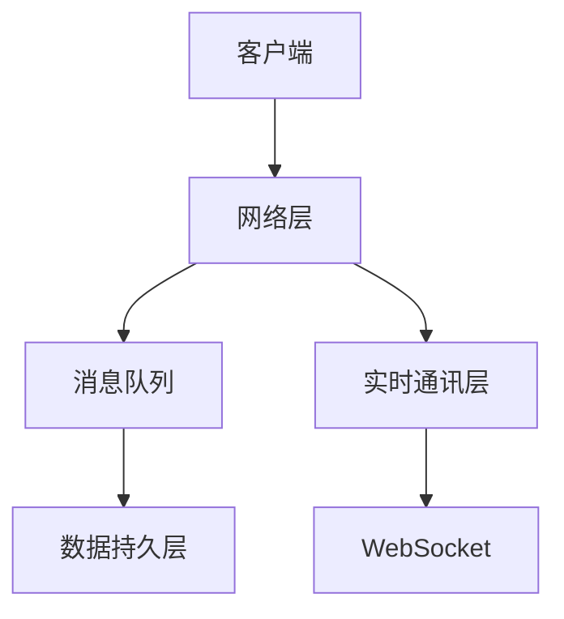

  

    
  

	<h1 align="center"><b>TeliQ</b></h1>
	

		A Telegram-like App for TeliQ
     
     
    <b>Download for </b>
		<a href="https://github.com/wibus-wee/TeliQ/archive/refs/heads/main.zip">Source Code</a>
     
  

<pre align="center">
🧪 Working in Progress
</pre>

## 🌟 Features

- [ ] Login with Protocols
- [ ] Chat with TeliQ
- [ ] Local Stickers
- [ ] Multiple Accounts & Platforms
- [ ] Multiple Languages
- [ ] Chat History & Chat Directory
- [ ] Theme & Style Settings
- [ ] More...

## 👀 Preview

## ⛏️ Design

## 📄 License

TeliQ is licensed under AGPL-3.0. You can use it for free, but you must open source your code.

## 🧑‍⚖️ Author

TeliQ © Wibus, Released under AGPL-3.0. Created on Nov 3, 2024.

> [Personal Website](http://wibus.ren/) · [Blog](https://blog.wibus.ren/) · GitHub [@wibus-wee](https://github.com/wibus-wee/) · Telegram [@wibus✪](https://t.me/wibus_wee)